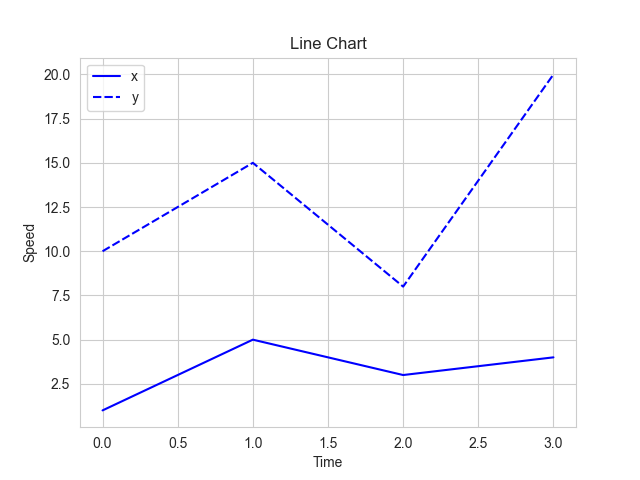

# Data Visualization API using Flask

This project is a backend API that generates plots from JSON data using Flask and Matplotlib/Seaborn. You send the data and plot configuration, and it returns a downloadable PNG image of the plot.

## Features
- Accepts JSON data and plot settings via POST request
- Supports line and bar plots
- Returns plot as a PNG image
- Tested using Postman to send JSON POST requests with custom payloads. Postman makes it easy to test API endpoints by allowing you to craft and send JSON data, view responses, and debug errors interactively.

git clone https://github.com/ShantanuT246/data-viz-backend.git
cd data-viz-backend
pip install -r requirements.txt
python app.py

## Example Input (JSON)
Send a POST request to `http://127.0.0.1:5000/plot` with the following JSON body:

```json
{
  "data": {
    "x": [1, 2, 3, 4],
    "y": [10, 20, 15, 30]
  },
  "plot_type": "line",
  "xlabel": "X-Axis",
  "ylabel": "Y-Axis",
  "title": "Sample Line Plot",
  "colors": ["blue"]
}
```

## Sample Screenshot


